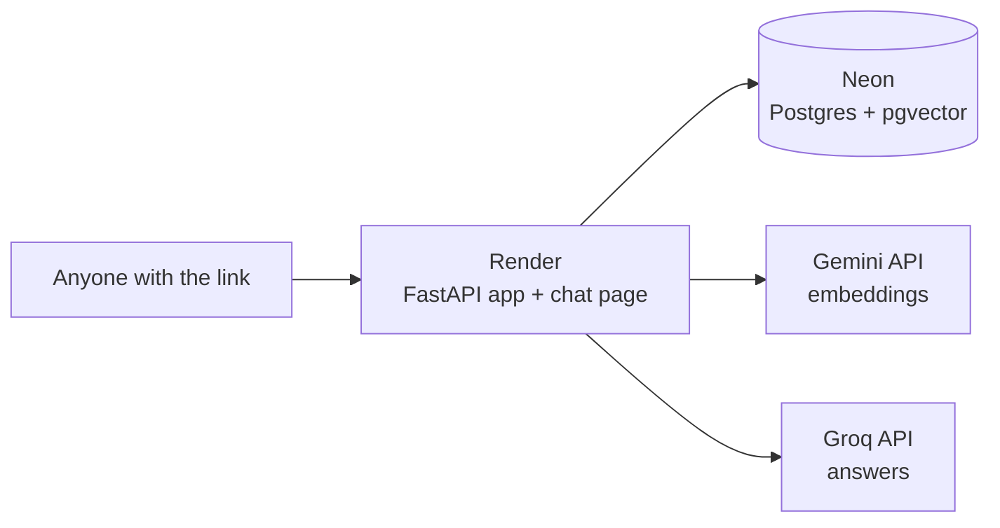

# Deploy the Tender RAG app for FREE (beginner guide)

This puts your chatbot online at a public URL, using only free services. No credit
card, no servers to manage. Follow the steps in order — it takes about 30 minutes
the first time.

## The free stack

| Piece | Free service | What it does |
|---|---|---|
| **App** | **Render** (free web service) | runs the FastAPI app + chat page |
| **Database** | **Neon** (free Postgres + pgvector) | stores tenders + the "meaning numbers" |
| **Embeddings** | **Google Gemini** (free API) | turns text into 768-number vectors |
| **Answers** | **Groq** (free API) | writes the chat answers |

**Why the change from your PC?** Locally, embeddings run on **Ollama**, which needs
a lot of memory — too much for a free host. So in the cloud we swap embeddings to
**Google Gemini's free API**. It's also **768 numbers**, exactly like Ollama's, so
the database design doesn't change at all — we just re-make the vectors with Gemini.



**One important limit:** the cloud app is **query-only**. It answers questions
about the tenders you load into it, but it does **not** scrape new tenders (scraping
needs heavy programs — Playwright, Tesseract, LibreOffice — that don't fit a free
host). To add new tenders later, you scrape them on your PC and re-run the load step.

---

## Before you start

You'll create three free accounts (all free, no card):
- **Neon** — https://neon.tech (the database)
- **Google AI Studio** — https://aistudio.google.com/apikey (Gemini key)
- **Groq** — https://console.groq.com (you already have this key)
- **Render** — https://render.com (the host) — and a **GitHub** account to hold the code.

---

## Step 1 — Create the database (Neon)

1. Sign up at https://neon.tech and click **New Project**. Pick any name and region.
2. When it's created, open **Dashboard → Connection Details**. Note these 4 values
   (you'll need them twice):
   - **Host** — looks like `ep-cool-name-12345.us-east-2.aws.neon.tech`
   - **Database** — usually `neondb`
   - **User** — e.g. `neondb_owner`
   - **Password** — click to reveal/copy
3. That's it — Neon supports **pgvector** already; the next step turns it on.

---

## Step 2 — Get the Gemini key (free)

1. Go to https://aistudio.google.com/apikey and click **Create API key**.
2. Copy the key and keep it safe for Step 3 and 5. (Most keys start with `AIza...`;
   a different format is fine **as long as it's a long-lived API key** — avoid
   temporary/session tokens, which expire and would break the live app.)

You already have your **Groq** key from before (`gsk_...`).

---

## Step 3 — Load your tenders into the cloud database (from your PC)

This reads the tenders already scraped on your PC and writes them — with **Gemini**
embeddings — into your Neon database. Run it in the `tender_rag` folder.

Open **PowerShell** in `c:\anshul\MVP\tender_rag` and set the cloud values just for
this session (this does **not** change your local `.env`):

```powershell
$env:POSTGRES_HOST     = "ep-cool-name-12345.us-east-2.aws.neon.tech"   # your Neon host
$env:POSTGRES_DB       = "neondb"
$env:POSTGRES_USER     = "neondb_owner"
$env:POSTGRES_PASSWORD = "YOUR_NEON_PASSWORD"
$env:POSTGRES_SSLMODE  = "require"
$env:GOOGLE_API_KEY    = "AIza...your-gemini-key..."

# 1) create the tables + turn on pgvector in Neon (once)
.venv\Scripts\python scripts\load_data.py --init

# 2) load all your tenders (embeds every chunk with Gemini)
.venv\Scripts\python scripts\load_data.py
```

You should see something like `Loaded: 15 tenders, 36 documents, 2066 chunks`.
Your data now lives in Neon with Gemini vectors. (This step re-uses the tender
files already on your disk — nothing is re-scraped.)

> Close this PowerShell window afterwards so the temporary values disappear. Your
> local setup (`.env`) is untouched.

---

## Step 4 — Put the code on GitHub

Render deploys from a Git repository. Push the `tender_rag` folder to a **new GitHub
repo** (make `tender_rag` the repo's top folder so the `Dockerfile` sits at the root).

```powershell
cd c:\anshul\MVP\tender_rag
git init
git add .
git commit -m "Tender RAG app for deploy"
# create an empty repo on github.com first, then:
git remote add origin https://github.com/<you>/tender-rag.git
git branch -M main
git push -u origin main
```

> The `.gitignore`/`.dockerignore` keep secrets out: your real `.env` is **not**
> uploaded. Double-check that `.env` is not in the commit — only `.env.example`
> should be there.

---

## Step 5 — Deploy on Render

Easiest way (uses the included `render.yaml`):

1. Go to https://render.com → **New → Blueprint**.
2. Connect your GitHub and pick the `tender-rag` repo. Render reads `render.yaml`
   and sets up a free web service automatically.
3. It will ask you to fill the **secret** values (the ones marked "sync: false"):

   | Key | Value |
   |---|---|
   | `POSTGRES_HOST` | your Neon host (`ep-...neon.tech`) |
   | `POSTGRES_DB` | `neondb` |
   | `POSTGRES_USER` | your Neon user |
   | `POSTGRES_PASSWORD` | your Neon password |
   | `GOOGLE_API_KEY` | your Gemini key (`AIza...`) |
   | `GROQ_API_KEY` | your Groq key (`gsk_...`) |

   (The non-secret ones — `POSTGRES_SSLMODE=require`, `ENABLE_SCRAPING=false`,
   model names, `TOP_K` — are already filled from `render.yaml`.)
4. Click **Apply / Create**. Render builds the Docker image and starts the app
   (first build ~3–5 min).

**Manual alternative (no Blueprint):** New → **Web Service** → connect the repo →
Render detects the `Dockerfile` → set the same environment variables by hand →
Create.

---

## Step 6 — Try it

1. Render gives you a URL like `https://tender-rag.onrender.com`.
2. Open `https://<your-app>.onrender.com/health` — you want `"status": "ok"` with
   `embed_provider: gemini`, `chat_provider: groq`, `pgvector: ok`.
3. Open `https://<your-app>.onrender.com/` — the chat page. Ask a question, e.g.
   *Source* `zppa`, *Tender ID* `28231539`, *"What is the closing date?"*

Share that link with anyone — it's live.

---

## Good to know (free-tier behaviour)

- **First request is slow (~30–60s), then fast.** Render's free service **sleeps**
  after 15 minutes of no traffic and takes ~a minute to wake up. After it's awake,
  answers are quick again.
- **It won't scrape new tenders in the cloud** (by design). To add tenders: scrape
  them on your PC as usual, then re-run **Step 3** — the new ones get loaded into
  Neon and appear online. (Loading the same tender again just updates it.)
- **Free limits:** Neon free = 0.5 GB (your data is ~33 MB, tons of room). Gemini
  and Groq free tiers are generous for one-question-at-a-time use; heavy bursts can
  hit a rate limit (the app already handles Groq limits by retrying / falling back).
- **Keys stay secret.** They live only in Render's environment settings and your
  local shell — never in the code or GitHub.

## If something's wrong

- `/health` shows `postgres: error` → check the 4 Neon values and that
  `POSTGRES_SSLMODE=require` is set.
- `/health` shows `google_key: MISSING` or `groq_key: MISSING` → the env var isn't
  set on Render; add it and redeploy.
- `pgvector: extension not created` → you skipped `load_data.py --init` (or run
  `CREATE EXTENSION vector;` once in Neon's SQL editor).
- A question says *"not loaded on this server"* → that tender isn't in Neon yet;
  load it via Step 3, or ask about one that is loaded (or omit the Tender ID to
  search all loaded tenders).
