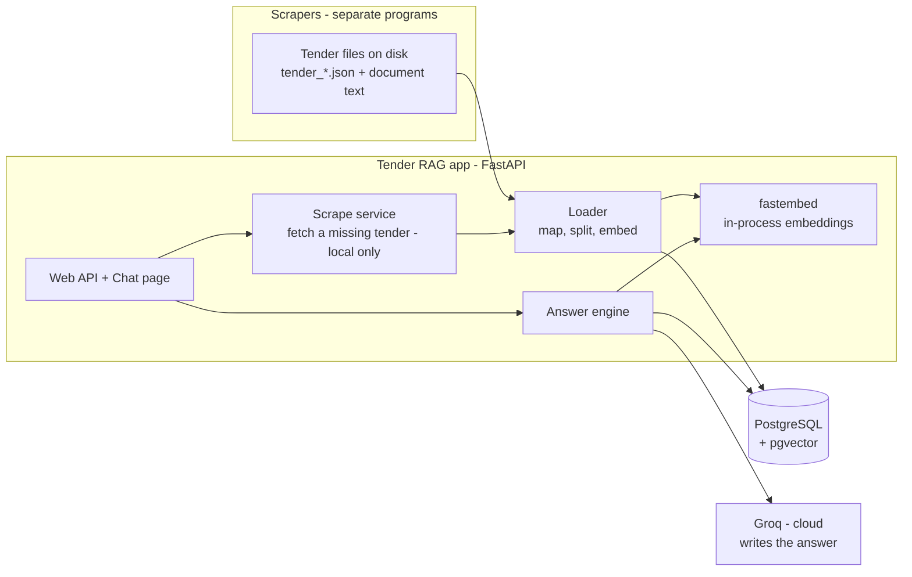
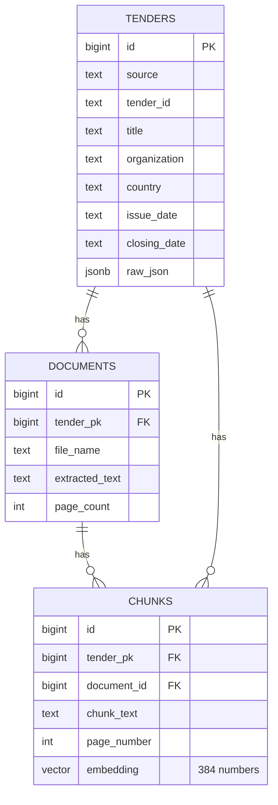
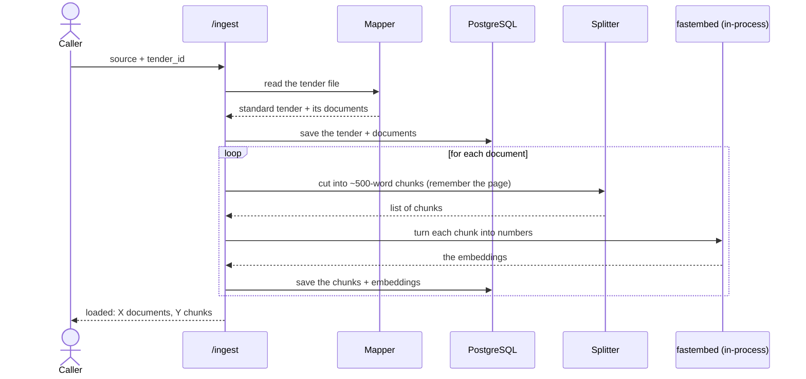
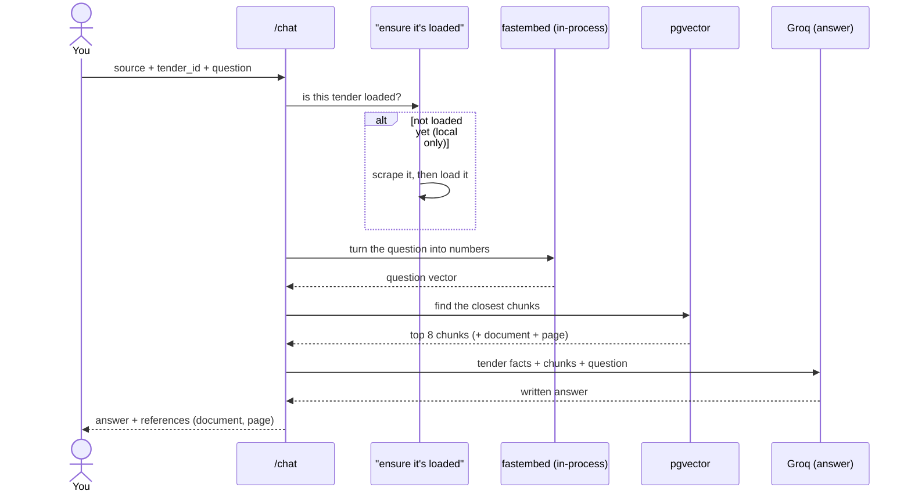
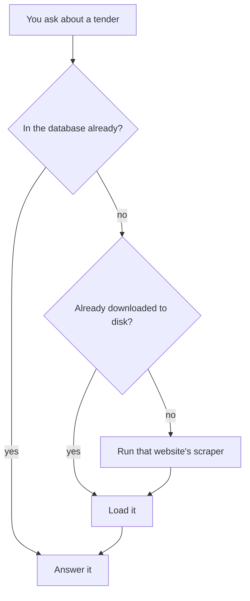
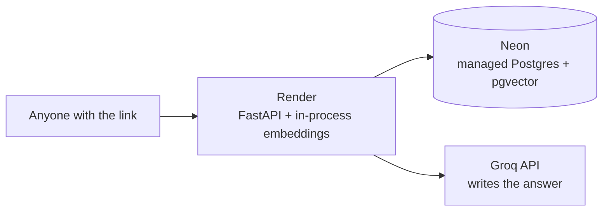

# Tender RAG — How it's built (with pictures)

This explains **how the app works inside**, in simple words, with diagrams.
If you just want to use it, read the main [README](../README.md) first.

Quick reminder of the idea: you ask a question about a tender, and the app
answers using that tender's real documents. It does this by (1) turning text
into "meaning numbers", (2) finding the closest ones to your question, and
(3) letting an AI write the answer from them. That method is called **RAG**
(Retrieve, then Generate).

> **How to read the diagrams:** each box is a part of the system; each arrow
> means "sends data to". A plain-English explanation comes right after every
> diagram.

---

## 1. The big picture

**In words:**
- The **scrapers** (separate programs) download tenders from 9 websites and save
  them as files.
- The **Loader** reads those files, splits the documents into small pieces, uses
  the **built-in fastembed model** to turn each piece into meaning-numbers, and
  stores everything in **PostgreSQL + pgvector**.
- When you ask a question, the **Answer engine** embeds your question (again with
  fastembed), finds the closest pieces in the database, and asks **Groq** (fast
  cloud AI) to write the answer.
- If you ask about a tender that isn't loaded, the **Scrape service** runs the
  right website's scraper first, then loads it. *(This is local only; the cloud
  version is query-only.)*

The embeddings run **inside the app** (no separate service, no API key, no limits).
Only the answer-writer (**Groq**) is a cloud call.

---

## 2. What's stored in the database (3 tables)

*(Some columns are left out above to keep it readable — see `db/init.sql` for all.)*

**In words — three tables, linked like folders inside folders:**
- **`tenders`** — one row per tender. The basic facts: title, organization,
  country, published date, closing date, etc. It also keeps the **whole original
  file** in `raw_json`, so nothing is ever lost.
- **`documents`** — one row per file attached to a tender, with its full text.
- **`chunks`** — the important one. Each document is cut into small pieces
  ("chunks"). Each chunk stores its text, which page it came from, and its
  **embedding** (the list of 384 numbers that represents its meaning).

The `chunks.embedding` column is the special **pgvector** type, sized `VECTOR(384)`
to match the embedding model. A **HNSW index** on it makes "find the closest
chunks" very fast, even with thousands of chunks.

**The dates are stored as plain text on purpose** — the 9 websites write dates in
several formats (e.g. `2026-08-05`, `5th August 2026`, `13 Aug 2026`), so we keep
them exactly as written; the AI reformats them nicely when it answers.

> **Note on the vector size:** the number 384 comes from the embedding model
> (`bge-small`). If you ever switch models, the column size must match — the loader
> script (`scripts/load_data.py --reset`) rebuilds the table at the right size.

---

## 3. Loading a tender (step by step)

**In words:** read the tender file → convert it to a standard shape (the
"Mapper") → save the tender and its documents → cut each document into chunks →
turn each chunk into numbers with the built-in fastembed model → save the chunks.
After this, the tender is ready to answer questions.

This is **safe to repeat** — loading the same tender again just replaces its old
data, so you never get duplicates.

---

## 4. Answering a question (step by step)

**In words:**
1. Check the tender is loaded (if not, fetch it first — local only, see section 5).
2. Turn your question into numbers (fastembed, in-process — takes milliseconds).
3. Ask pgvector for the **8 chunks** closest in meaning.
4. Send the tender's basic facts + those chunks + your question to Groq.
5. Groq writes a short answer that only uses what it was given, formats it nicely,
   and cites the document + page. You get it back.

---

## 5. Asking about a tender that isn't loaded (auto-fetch — local only)

On your PC you don't have to load a tender before asking. The app figures it out:

**In words:** first it checks the database; if not there, it checks whether the
tender was already downloaded; if not, it runs the right website's scraper to
download it, then loads it, then answers. The first time is slower (it has to
download); after that it's instant. Works for 8 of the 9 sites automatically —
**nra** needs a human-verification check, so that one is loaded by hand.

**In the cloud this is switched off** (`ENABLE_SCRAPING=false`) — the hosted app
only answers tenders that were pre-loaded, because the scrapers need heavy programs
that don't fit a free host.

---

## 6. The 9 "Mappers" (why they're needed)

Each of the 9 websites saves tenders in a **different layout** — different field
names, and different ways of listing documents (some call them `documents`, one
calls them `attachments`, two have a single `document`). A RAG system needs one
consistent shape, so `services/normalize.py` has **one small mapper per website**
that translates its layout into the standard `tenders` + `documents` shape.

Adding a 10th website later = write one more mapper. Everything else (splitting,
embedding, searching, answering) stays the same.

---

## 7. Two ways to ask

- **About one tender** — give a `source` + `tender_id`. It only looks inside that
  tender. (e.g. "What is the closing date of tender PR/PPADB/055?")
- **About all loaded tenders at once** — leave out the tender id. It searches
  **every** loaded tender and tells you which one each fact came from. (e.g.
  "Which tenders are for construction?") Sources are cited as
  `[tender | document p.page]`.

---

## 8. How documents are split (chunking)

The scrapers already give us each document **page by page**. We cut each page
into chunks of about **500 words** (with a little overlap so sentences aren't cut
awkwardly). Because we split **inside each page**, every chunk remembers its real
**page number** — that's how the answers can cite the exact page.

Tiny leftover pieces (like a lone page number) are dropped, since there's nothing
useful to search in them.

---

## 9. How the AI is told to answer (the prompt)

Before Groq writes an answer, it's given strict instructions:
- Use **only** the tender facts and chunks provided — no outside knowledge.
- **Cite** the document and page for each fact.
- If the answer isn't in the provided text, **say "not available"** — don't guess.
- **Match the user's wording by meaning** — "ending date", "deadline" and "closing
  date" are the same; the published date, closing date and bid-opening date are
  **different** and must never be swapped. It also handles **opposite/yes-no**
  questions ("are alternative bids allowed?" when the document says "not permitted").
- **Format the answer nicely** — full sentences (not raw field dumps), dates
  reformatted (`2026-08-28` → "28 August 2026"), and amounts shown with a currency.

This is what keeps answers trustworthy, readable, and stops the AI making things up.

---

## 10. Finding the closest chunks (retrieval)

pgvector compares your question's numbers to every chunk's numbers using **cosine
distance** (a standard "how similar in meaning" measure) and returns the closest
few (**default 8** — enough that the right page is included even in a 100+ page
document). The **HNSW index** makes this fast. This search code is kept separate,
so the storage could be swapped later without touching the rest.

---

## 11. Why it's fast (~0.5 seconds)

The whole pipeline is quick because none of it is heavy:
- **Making the question's numbers** happens **inside the app** (fastembed, a small
  ONNX model). The model loads once when the app starts (a few seconds, one time),
  then each question embeds in **~10–50 milliseconds**.
- **The pgvector search** over the HNSW index takes a few milliseconds.
- **Groq** writes the answer in **~0.3–1 second**.

So after the one-time startup, a question is about **half a second**. If Groq is
ever busy or rate-limited, the app automatically drops to a **smaller Groq model**,
and only as a last resort to a **local model** (slower) — so it never just fails.

---

## 12. When something goes wrong (error handling)

The app fails **safely and clearly**, never with a made-up answer:
- Tender not found and can't be fetched → a clear message telling you what to do.
- The tender exists nowhere / has closed → "it may have closed", not a guess.
- Groq busy or rate-limited → auto-retry, then a smaller model, then a local model.
- No relevant chunks found → "I couldn't find relevant content", not invention.
- `/health` shows the status of the database, pgvector, the embedding model, and
  the chat provider at a glance.

---

## 13. Running it in the cloud (for free)

The same app runs on a free host with two settings changes: embeddings already run
in-process (so no GPU or extra service is needed), and scraping is turned off.

- **App** → a free Render web service (Docker image with the model baked in).
- **Database** → a free Neon Postgres with pgvector.
- **Answers** → Groq's free tier.
- **Data** is loaded once from your PC into Neon; the cloud app is **query-only**.

See **[../DEPLOY.md](../DEPLOY.md)** for the full step-by-step.

**For heavier production use later:** load tenders in the background (a queue +
workers), cache common answers (Redis), tune the pgvector index for large data, and
put secrets in a vault. Because the embedder and the answer-writer live behind small
separate files (`services/embeddings.py`, `services/llm.py`), swapping either is a
settings change — not a rewrite.

---

## 14. Setting it up from scratch

1. **Install PostgreSQL 18.**
2. **Add pgvector:** `scripts/install_pgvector.ps1` (builds the add-on and copies
   it into PostgreSQL — needs admin once).
3. **Python:** `py -3.12 -m venv .venv` then `pip install -r requirements.txt`
   (this installs **fastembed**, the in-process embedding model — nothing else to
   run for embeddings).
4. **Settings:** copy `.env.example` to `.env`; set `POSTGRES_PASSWORD`,
   `EMBED_PROVIDER=fastembed`, and a free `GROQ_API_KEY` (from
   https://console.groq.com).
5. **Create the tables:** `scripts/setup_db.ps1`.
6. **Load tenders:** `scripts/ingest_all.py`, then run `uvicorn app.main:app` and
   open http://localhost:8000/.

*(Optional: install Ollama and `ollama pull llama3.2:3b` only if you want an offline
chat fallback. It is not used for embeddings.)*
